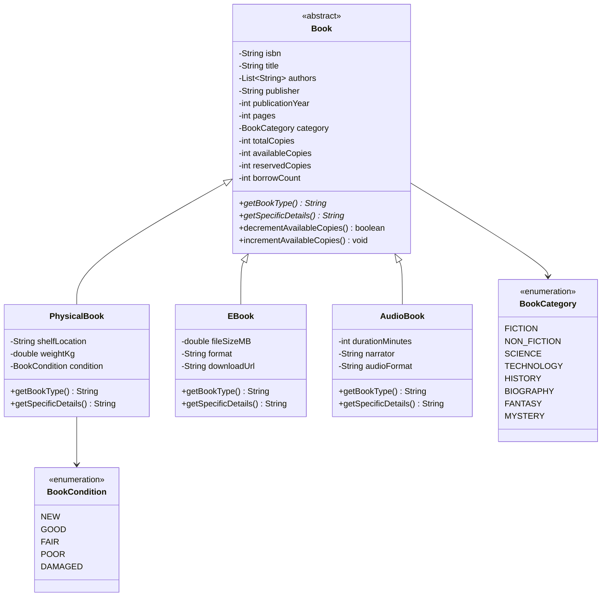
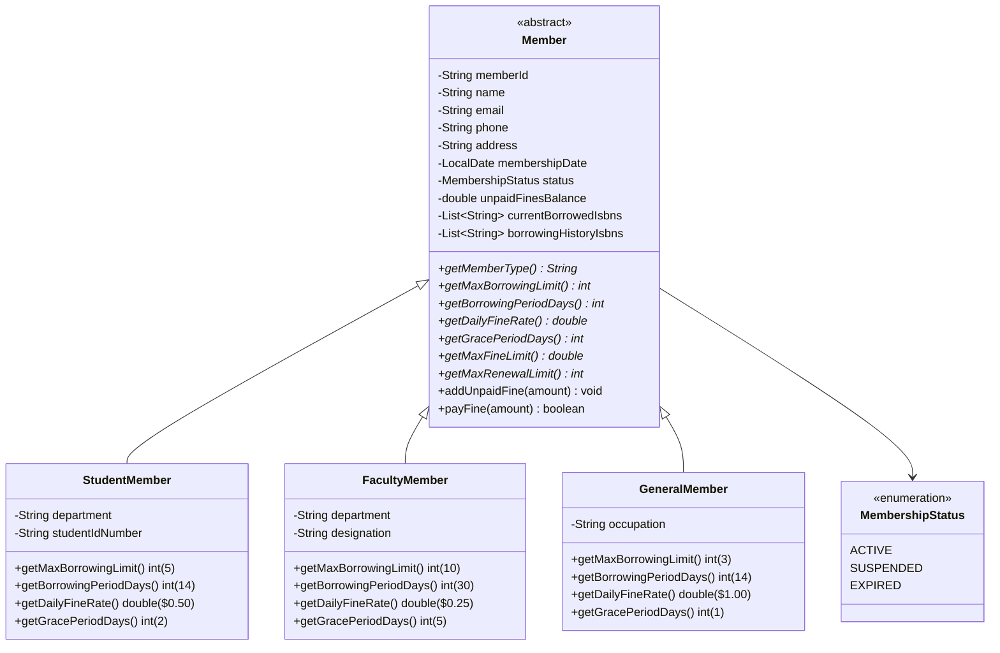
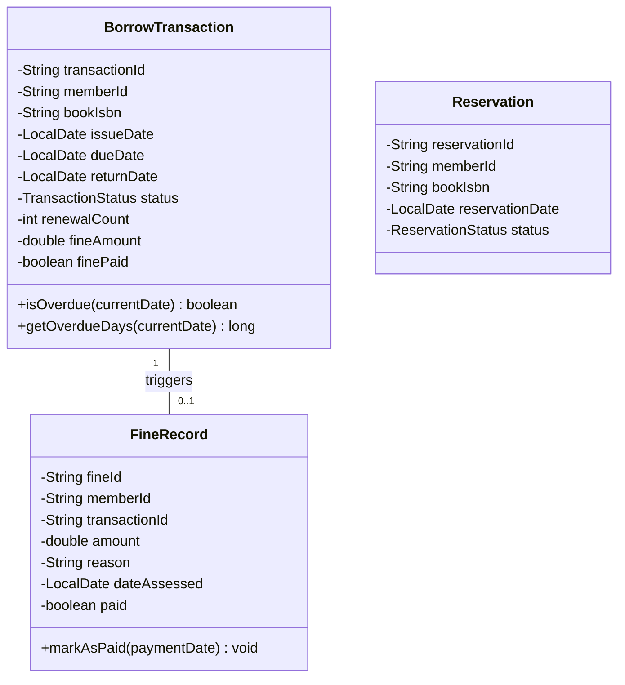

# Architecture & Digital UML Class Diagrams

> **Library Management System with Advanced Features**  
> High-level architectural layout, design patterns, and UML diagrams.

---

## 🏛 System Architecture Layers

The application is structured into 5 clean, decoupled layers adhering to SOLID design principles:

```
+-------------------------------------------------------------------+
|                        Console UI Layer                           |
|                       (ConsoleUI.java)                            |
+-------------------------------------------------------------------+
                                  |
                                  v
+-------------------------------------------------------------------+
|                        Service Layer                              |
| (BookService, MemberService, BorrowingService, SearchService,     |
|  RecommendationService, AnalyticsService, DataPersistenceService) |
+-------------------------------------------------------------------+
                                  |
                                  v
+-------------------------------------------------------------------+
|                      Repository Layer                             |
| (BookRepository, MemberRepository, TransactionRepository)         |
+-------------------------------------------------------------------+
                                  |
                                  v
+-------------------------------------------------------------------+
|                        Domain Models                              |
| (Book [Physical/EBook/AudioBook], Member [Student/Faculty/Gen],   |
|  BorrowTransaction, Reservation, FineRecord, Enums)              |
+-------------------------------------------------------------------+
                                  |
                                  v
+-------------------------------------------------------------------+
|                     Persistence Layer                             |
|                 (JSON files in data/ directory)                   |
+-------------------------------------------------------------------+
```

---

## 📐 Digital UML Class Diagrams (Mermaid)

### 1. Book Inheritance Hierarchy



### 2. Member Inheritance & Privileges Hierarchy



### 3. Transaction & Fine Relationships



---

## 🎨 Applied Design Patterns

1. **Strategy / Template Method Pattern**: Member privilege profiles (`StudentMember`, `FacultyMember`, `GeneralMember`) encapsulate customized policies for borrowing limits, fine rates, and grace periods.
2. **Repository Pattern**: `BookRepository`, `MemberRepository`, and `TransactionRepository` abstract in-memory data storage and retrieval.
3. **Service Layer Pattern**: Business logic decoupled from presentation layer (`BookService`, `MemberService`, `BorrowingService`, `SearchService`, `RecommendationService`, `AnalyticsService`).
4. **Collaborative Filtering Recommendation Pattern**: Recommends items using Jaccard Similarity index over member borrowing histories.
